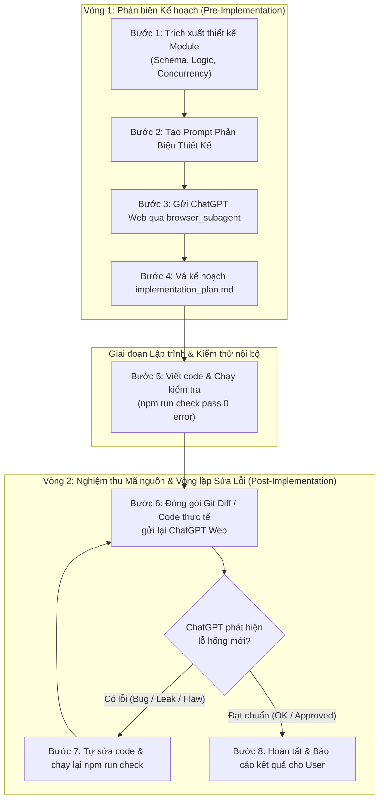

# Kỹ Năng Phối Hợp Phản Biện Kế Hoạch & Nghiệm Thu Mã Nguồn Với ChatGPT (Web)

Tài liệu này chuẩn hóa quy trình làm việc khép kín giữa Antigravity và ChatGPT trên giao diện web nhằm mục đích **phản biện đối kháng 2 vòng (Two-phase adversarial review)**:
1. **Vòng 1 (Trước khi code):** "Vạch lá tìm sâu", phát hiện mọi lỗ hổng bảo mật, xung đột dữ liệu, race conditions và thiếu sót nghiệp vụ trong kế hoạch trước khi bắt đầu lập trình.
2. **Vòng 2 (Sau khi code xong):** Kiểm tra nghiệm thu mã nguồn thực tế (Code Audit), phát hiện sai lệch so với thiết kế hoặc cạm bẫy mới sinh ra trong quá trình implement; lặp lại việc sửa lỗi cho đến khi ChatGPT xác nhận an toàn tuyệt đối mới báo hoàn thành.

---

## 1. Nguyên Tắc Cốt Lõi Của Quy Trình Phản Biện

1. **Không tự mãn:** Mọi kế hoạch và đoạn code mới dù chi tiết và pass test vẫn có điểm mù (blind spots). Việc đưa sang ChatGPT phản biện cả kế hoạch lẫn code thực tế là bắt buộc để có góc nhìn độc lập thứ hai (Second Opinion).
2. **Cung cấp ngữ cảnh kỹ thuật sâu (Deep Context Ingestion):** Khi gửi sang ChatGPT, không mô tả chung chung mà phải đưa ra:
   - Schema bảng (PostgreSQL data types, indexes, unique constraints).
   - State machine và mã HTTP status.
   - Cơ chế khóa (Redis distributed lock, PostgreSQL `FOR UPDATE SKIP LOCKED`).
   - Công thức toán học (đặc biệt là tiền tệ, `bigint` milli-coin, chiết khấu).
   - Ràng buộc môi trường (Pterodactyl Wings API, Node 24, AdonisJS 7).
3. **Phân loại phản biện (Triage):** Mọi đóng góp từ ChatGPT phải được phân loại thành 3 nhóm:
   - **Nhóm 1 (Critical Blocker):** Lỗ hổng có thể làm mất tiền, mất server, lộ dữ liệu hoặc treo hệ thống $\to$ Bắt buộc vá vào kế hoạch hoặc sửa code ngay.
   - **Nhóm 2 (Operational Improvement):** Tối ưu hóa hiệu năng, cải thiện trải nghiệm admin/khách, thêm log/audit trail $\to$ Bổ sung vào danh mục task phụ.
   - **Nhóm 3 (False Positive / Out of Scope):** Góp ý không phù hợp với hợp đồng hệ thống (ví dụ: đòi sửa trực tiếp DB Pterodactyl) $\to$ Giải trình rõ lý do từ chối.

---

## 2. Quy Trình Phối Hợp Khép Kín (Closed-Loop Workflow)



---

## 3. Khung Phản Biện 6 Chiều (6-Axis Adversarial Framework)

Khi chuẩn bị nội dung phản biện hoặc tiếp nhận phản hồi từ ChatGPT (cả giai đoạn kế hoạch và code diff), tập trung mổ xẻ theo 6 trục sau:

### Trục 1: Tranh chấp đồng thời & Khóa dữ liệu (Race Conditions & Concurrency)

- Nếu người dùng mở 10 tab spam cùng một mili-giây, request có bị lọt qua tầng `SELECT` kiểm tra không?
- Khóa phân tán Redis có TTL bao lâu? Nếu worker chết giữa chừng, khóa có tự giải phóng không?
- Có nguy cơ deadlock khi hai transaction cùng khóa `users` và `card_topups` theo thứ tự ngược nhau không?

### Trục 2: Bảo mật & Chữ ký mật mã (Security & Cryptography)

- Chữ ký callback (MD5/HMAC) có chống được Replay Attack và Timing Attack không (sử dụng `crypto.timingSafeEqual`)?
- Endpoint Webhook có bị tấn công brute-force không? Rate limit bao nhiêu request/phút?
- Có nguy cơ IDOR (Insecure Direct Object References) khi đọc hoặc cập nhật bản ghi không?

### Trục 3: Toàn vẹn tiền tệ & Sổ cái (Ledger & Math Integrity)

- Mọi phép tính tiền có dùng số nguyên thuần túy (`bigint` milli-coin x1000) không? Tuyệt đối không dùng `number` dấu phẩy động.
- Khi khách khai gian mệnh giá (thẻ 10k khai 500k), công thức tính có tự động lấy mệnh giá thực do nhà mạng trả về không?
- Idempotency Key của giao dịch có được ràng buộc `UNIQUE` ở database không?

### Trục 4: Trạng thái mạng mơ hồ & Chịu lỗi (Fault Tolerance & Ambiguous States)

- Khi gọi API bên thứ ba (Pterodactyl / TheSieuToc) bị timeout 8s, hệ thống xử lý ra sao?
- Có bị gọi lại (retry) nhầm khiến giao dịch bị ghi trùng không?
- Background job đối soát (`reconcile job`) có giới hạn batch và exponential backoff để tránh bão request không?

### Trục 5: Ràng buộc Cơ sở dữ liệu (Database Schema Invariants)

- Các khóa ngoại có ràng buộc `ON DELETE CASCADE` hoặc `ON DELETE RESTRICT` phù hợp không?
- Có index cho các câu lệnh `WHERE status = 'pending' ORDER BY created_at` không?
- Có CHECK constraint giới hạn enum giá trị hợp lệ ở tầng database không?

### Trục 6: Nghiệp vụ thực tế & Cạm bẫy hạ tầng (Domain Invariants)

- Cạm bẫy Pterodactyl Defect #14: Pterodactyl cấp lại ID số của server đã xóa cho server mới. Đã bắt buộc truyền `expectedUuid` chưa?
- Server gán mới có bị trừ tiền lùi (retroactive billing) làm âm tài khoản khách không?

---

## 4. Mẫu Prompt Vòng 1: Phản Biện Kế Hoạch (Pre-Implementation)

Agent sử dụng mẫu template dưới đây để tạo prompt gửi sang ChatGPT trên web trước khi viết code:

```markdown
### YÊU CẦU PHẢN BIỆN KỸ THUẬT (RED-TEAM ADVERSARIAL REVIEW)

Tôi đang triển khai module: **[Tên Module, ví dụ: Cổng Nạp Thẻ Cào TheSieuToc]** cho hệ thống Hosting Dashboard (Stack: AdonisJS 7, TypeScript, PostgreSQL, Redis).

Bạn hãy đóng vai là một **Principal Software Architect & Lead Security Auditor** cực kỳ khó tính và giàu kinh nghiệm. Nhiệm vụ của bạn là **vạch lá tìm sâu, tấn công và tìm ra mọi lỗ hổng tiềm ẩn** trong bản thiết kế dưới đây:

#### 1. THÔNG SỐ THIẾT KẾ:

[Mô tả schema database, types, service logic, cơ chế khóa, background job]

#### 2. CÂU HỎI TRỌNG TÂM CẦN BẠN TẤN CÔNG:

1. Concurrency: Có kịch bản race condition nào lọt qua được Redis lock và DB unique constraint không?
2. Cryptography: Cơ chế kiểm tra MD5 và so khớp chữ ký callback có lỗ hổng timing-attack hay MITM không?
3. Financial Integrity: Nếu khách khai gian mệnh giá hoặc nhà mạng phạt thẻ sai mệnh giá thì số dư coin có nguy cơ bị tính sai không?
4. Network Failure: Nếu kết nối mạng timeout sau 8 giây thì giao dịch có rơi vào trạng thái treo hoặc bị lặp không?
5. Database Invariants: Bảng dữ liệu có thiếu index, thiếu lock order gây deadlock, hay thiếu constraint nào không?

Hãy phản biện thẳng thắn, chi tiết từng dòng code/schema và đề xuất phương án vá ngay lập tức!
```

---

## 5. Mẫu Prompt Vòng 2: Nghiệm Thu Mã Nguồn Thực Tế (Post-Implementation Code Audit)

Sau khi viết code và vượt qua `npm run check` (`typecheck` + `lint` 0 error), Agent trích xuất git diff hoặc nội dung code thực tế gửi tiếp vào cùng cuộc hội thoại ChatGPT web:

```markdown
### YÊU CẦU KIỂM TRA NGHIỆM THU MÃ NGUỒN (POST-IMPLEMENTATION CODE AUDIT)

Tôi đã hoàn tất việc viết code cho module **[Tên Module]** dựa trên kế hoạch đã thống nhất với bạn. Code hiện tại đã vượt qua kiểm tra cú pháp và kiểu dữ liệu cục bộ (`npm run check` 0 error).

Dưới đây là toàn bộ mã nguồn / git diff các thay đổi vừa thực hiện:

\`\`\`diff
[Dán git diff hoặc toàn bộ nội dung code các file đã sửa/tạo mới]
\`\`\`

Bạn hãy đóng vai trò **Lead Code Reviewer & Security Auditor** kiểm tra lại một lượt thật gắt gao:
1. Code thực tế đã bám sát 100% các giải pháp đã chốt ở kế hoạch trước đó chưa?
2. Có phát sinh thêm lỗ hổng mới nào trong quá trình viết code không (race condition, rò rỉ tài nguyên, rò rỉ transaction/DB connection, sót error handling, sai kiểu dữ liệu)?
3. Xử lý ngoại lệ (try/catch, rollback, release lock) đã thực sự an toàn trong mọi kịch bản lỗi chưa?

**Quy ước phản hồi:**
- Nếu phát hiện BẤT KỲ lỗi logic hoặc rủi ro nào: Chỉ rõ file, dòng code, cơ chế lỗi và cách khắc phục chính xác.
- Nếu code đã HOÀN TOÀN AN TOÀN và đạt chuẩn sản xuất: Hãy xác nhận rõ ràng câu: **"CODE ĐẠT CHUẨN - CHẤP THUẬN NGHIỆM THU"**.
```

---

## 6. Vòng Lặp Vá Lỗi Và Điều Kiện Hoàn Thành (Post-Implementation Loop & Gate)

1. **Gửi Code:** Agent gọi `browser_subagent` gửi Prompt Vòng 2 kèm git diff sang tab ChatGPT đang mở.
2. **Phân tích kết quả:**
   - **Trường hợp A (ChatGPT phát hiện lỗ hổng / góp ý quan trọng):**
     1. Agent không được báo hoàn thành với user.
     2. Agent tự động sửa code trong workspace để vá triệt để lỗ hổng ChatGPT vừa nêu.
     3. Chạy lại `npm run check` và unit test để đảm bảo 0 error cú pháp.
     4. Gọi lại `browser_subagent` gửi lại diff vừa sửa vào ChatGPT để hỏi lại: *"Tôi đã vá các điểm sau: [Mô tả]. Hãy kiểm tra lại."*
     5. Lặp lại chu trình này cho đến khi chuyển sang Trường hợp B.
   - **Trường hợp B (ChatGPT xác nhận đạt chuẩn):**
     1. Nhận được phản hồi "CODE ĐẠT CHUẨN" / không còn điểm nghẽn rủi ro từ ChatGPT.
     2. Chạy lần cuối kiểm tra toàn diện `npm run check` / `npm run test`.
     3. Tiến hành báo cáo hoàn thành nhiệm vụ cho user kèm tóm tắt các điểm đã được ChatGPT nghiệm thu.
